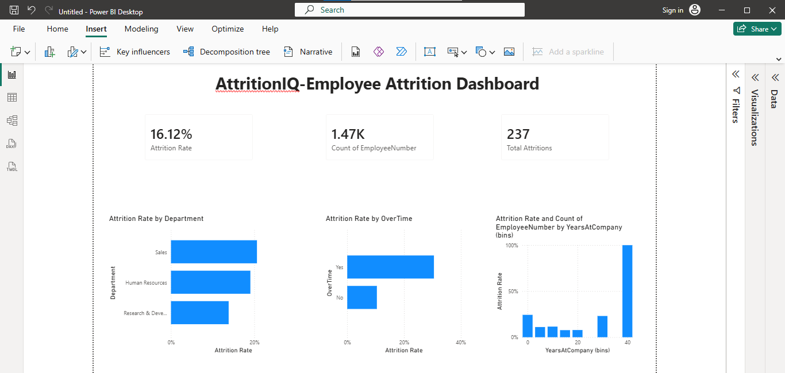

# AttritionIQ – AI-Powered Employee Attrition Analytics

This project was built using an **AI-assisted analytics workflow** — free AI tools (ChatGPT, Julius AI) were used at each stage to speed up data cleaning, exploration, and insight generation, while every AI-generated result was independently verified using traditional methods (Excel PivotTables, DAX in Power BI) to keep the analysis accurate and defensible.

## Dataset
**IBM HR Analytics Employee Attrition Dataset**
- 1,470 employees, 35 original columns
- Source: publicly available HR analytics dataset used widely for attrition analysis practice

## AI Tools Used & How They Were Applied
| Tool | Role in this project |
|---|---|
| **ChatGPT (free tier)** | Generated the Python/Pandas script used for the initial EDA — dataset shape, data types, attrition rate, and summary statistics |
| **Julius AI (free tier)** | Answered natural-language questions directly against the dataset (e.g. "which department has the highest attrition rate?", "does overtime correlate with attrition?") without writing manual queries |
| **Excel** | Used to independently verify every AI-generated number via PivotTables, so no AI output was accepted without confirmation |
| **Power BI + DAX** | Final interactive dashboard, built on the AI-validated findings |

## AI-Assisted Workflow

### 1. Data Cleaning (AI-assisted check, manually executed)
- Checked for missing values → none found
- Checked for duplicate rows → none found
- Dropped 3 constant columns with no analytical value (same value across all 1,470 rows): `EmployeeCount`, `Over18`, `StandardHours`
- Cleaned dataset: **1,470 rows × 32 columns**

### 2. Exploratory Data Analysis — generated by ChatGPT
ChatGPT was prompted to write and run a Pandas script producing:
- Dataset shape and column data types
- Overall attrition rate: **16.12% Yes / 83.88% No**
- Age: 18–60 (avg ~37) | Monthly Income: 1,009–19,999 (avg ~6,503)

*(Full AI-generated snapshot documented in `EDA_Snapshot.md`)*

### 3. Natural-Language Exploration — via Julius AI, cross-checked manually
Instead of writing SQL/Excel formulas from scratch, Julius AI was asked plain-English questions and returned instant tables/charts. Every result below was then re-derived manually in Excel to confirm accuracy before being trusted:

| Finding | Julius AI Result | Manual Excel PivotTable | Verified? |
|---|---|---|---|
| Attrition by OverTime | Yes: 30.53% / No: 10.44% | Yes: 30.53% / No: 10.44% |  Match |
| Highest attrition department | Sales – 20.63% | Confirmed via dashboard measures |  Match |

This AI + manual verification loop is the core methodology of the project — see `HR_Attrition_PivotCheck.xlsx` for the manual proof.

### 4. Power BI Dashboard (built on AI-validated findings)
Interactive dashboard (`AttritionIQ_Dashboard.pbix`) featuring:
- KPI cards: Attrition Rate (16.12%), Total Employees (1,470), Total Attritions (237)
- Attrition Rate by Department
- Attrition Rate by OverTime
- Attrition Rate by Tenure (YearsAtCompany)

## Key Findings & Business Recommendations
The dataset shows an overall attrition rate of 16.12%, meaning roughly 1 in 6 employees left the company. The strongest driver identified was overtime — employees working overtime left at nearly 3x the rate of those who didn't (30.53% vs 10.44%), pointing to workload or burnout as a likely factor worth investigating further. At the department level, Sales had the highest attrition rate at 20.63%, notably higher than Research & Development (13.84%) despite R&D being a much larger team — suggesting Sales-specific issues (compensation structure, targets, or manager relationships) rather than a company-wide problem.

**Recommendations:**
1. Review workload/overtime policy for high-overtime teams
2. Conduct targeted exit interviews within the Sales department
3. Investigate early-tenure retention programs (pending further validation of tenure-bucket sample sizes)

## Why This Project Matters
This project demonstrates a modern, AI-augmented analyst workflow: using AI tools like ChatGPT and Julius AI to move faster through cleaning and exploration, while still applying manual analytical rigor (Excel, DAX) to validate every finding before it's trusted or presented. The goal wasn't to let AI replace analysis — it was to use AI as a first-pass assistant, with human verification as the final check.

## Repository Contents
- `HR_Attrition_Cleaned.xlsx` – cleaned dataset
- `HR_Attrition_PivotCheck.xlsx` – manual verification of AI-generated findings
- `EDA_Snapshot.md` – documented pre-analysis data summary
- `Business_Recommendations.txt` – written recommendations
- `AttritionIQ_Dashboard.pbix` – Power BI dashboard file
- `Dashboard_screenshot.png` – dashboard preview image

## Author
Sammed Duradundi — [GitHub](https://github.com/Jdsammed)
